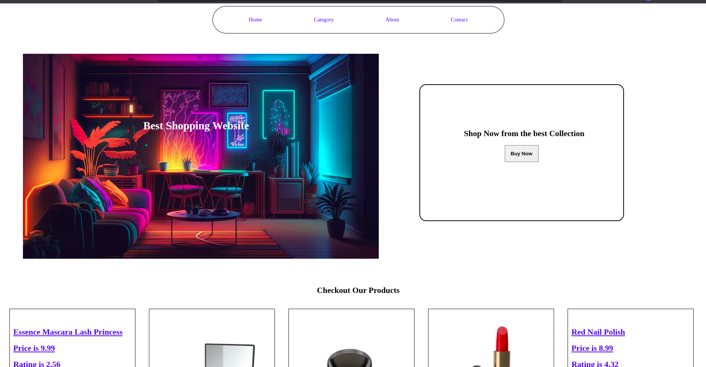
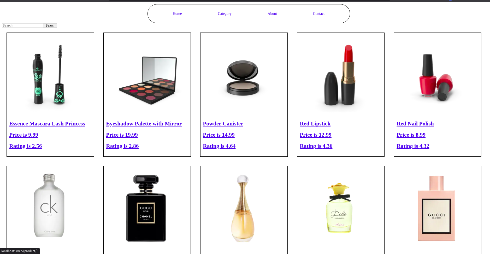

# 🛒 Dynamic React Store Skeleton

A fully dynamic and minimal **React store template** that fetches product data via APIs and renders dynamic pages. This is ideal for developers who want to build their own e-commerce store from scratch with full customization.

> ⚠️ This is a **barebones skeleton** meant to be styled and expanded as per your needs.

---

## ✨ Features

- ⚛️ Built with React
- 🧠 Dynamic routing for product/category pages
- 🌐 Fetches data from API (dummy or real)
- 🎨 Minimal CSS — make it your own!
- 💡 Easy to extend with your custom components
- 📦 Modular and clean folder structure

---

## 📸 Screenshots








---

## 🔧 Tech Stack

- **React** (with functional components & hooks)
- **CSS** (plain / modular — customize as you wish)
- **React Router DOM** for navigation
- **Fetch API** for data retrieval

---

## 🚀 Getting Started

```bash
git clone https://github.com/rajnisht7/store_skeleton.git
cd store_skeleton
npm install
npm start
